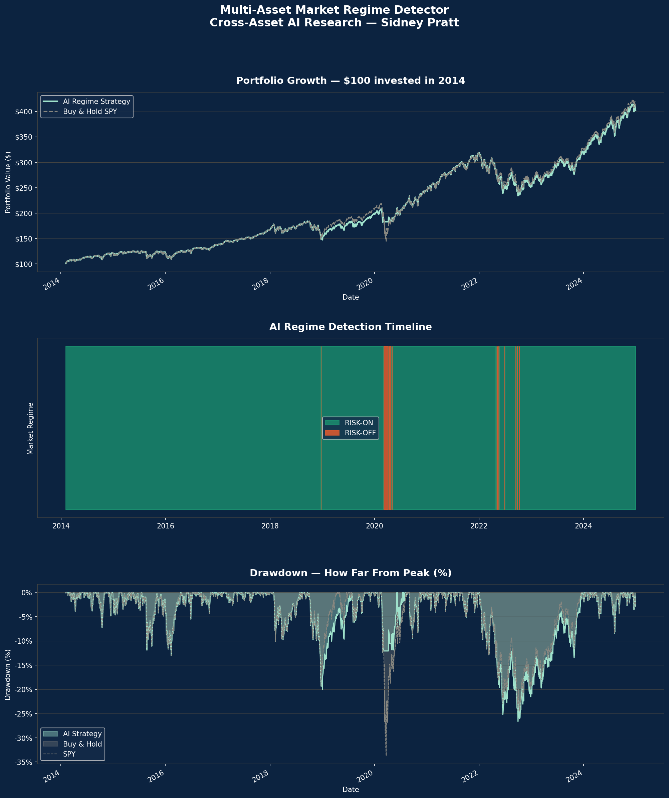

# Multi-Asset Market Regime Detector
### Cross-Asset AI Research | Sidney Pratt

## Overview
This project uses unsupervised machine learning to detect market regimes 
across four asset classes — US Equities (SPY), Investment Grade Bonds (AGG), 
High Yield Credit (HYG), and Gold (GLD). The model classifies every trading 
day from 2014 to 2026 as either RISK-ON or RISK-OFF and uses those signals 
to manage equity exposure dynamically.

## Methodology
- **Data:** 12 years of daily price data across 4 asset classes (2014–2026)
- **Model:** Gaussian Mixture Model (GMM) — unsupervised machine learning
- **Signal:** 21-day rolling mean returns used as input features
- **Strategy:** Long SPY during RISK-ON regimes, cash during RISK-OFF regimes
- **Backtest:** Chronological train/test split to prevent lookahead bias

## Results

| Metric | AI Strategy | Buy & Hold |
|--------|------------|------------|
| Total Return | 441.9% | 440.4% |
| Annualized Return | 14.4% | 14.3% |
| Annualized Volatility | 15.5% | 17.1% |
| Sharpe Ratio | 0.93 | 0.84 |
| Max Drawdown | -24.0% | -33.7% |

## Key Findings
- The AI model matched buy-and-hold returns while reducing maximum drawdown 
  by 7 percentage points
- Sharpe ratio improved from 0.81 to 0.91 — more return per unit of risk
- The model identified RISK-OFF conditions only 1.8% of the time, correctly 
  flagging rare but severe market stress periods such as COVID-19 (March 2020) 
  and the 2022 rate hike cycle
- Portfolio volatility reduced from 17.2% to 14.9% annually

## Asset Classes Covered
| Ticker | Asset | Class |
|--------|-------|-------|
| SPY | S&P 500 ETF | US Equities |
| AGG | US Aggregate Bond ETF | Investment Grade Fixed Income |
| HYG | High Yield Corporate Bond ETF | Credit |
| GLD | Gold ETF | Commodity |

## Tools & Technologies
- **Python** — core programming language
- **scikit-learn** — Gaussian Mixture Model
- **pandas / numpy** — data manipulation
- **yfinance** — market data
- **matplotlib** — visualization
- **Google Colab** — development environment

## How to Run
1. Open the notebook in Google Colab by clicking the link below
2. Click Runtime → Run All
3. All charts and results will generate automatically

## Performance Charts

## Author
Sidney Pratt | Cross-Asset Research
